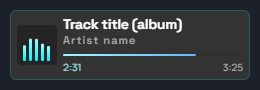

# Now Playing Widget

Компактный виджет «Now Playing» для OBS. Один HTML-файл, никаких зависимостей. Показывает название трека, исполнителя, прогресс-бар с анимацией и автоматическую прокрутку длинных названий.

### Как это выглядит



## Почему этот виджет?

Минималистичная альтернатива сложным аналогам типа **Tuna** (OBS Source Dock). Никакой настройки серверов, WebSocket-подключений и лишнего оверхеда. Простой файл → простой виджет.

Виджет ориентирован на **локальные плееры** (AIMP, Foobar2000, MusicBee и др.), которые умеют сохранять информацию о текущем треке в файл. Это **не** решение для веб-сервисов вроде Spotify или YouTube — для них есть Tuna и аналоги. Если вы слушаете музыку с компьютера и вам нужно просто показывать название трека в OBS — это решение для вас.

## Возможности

- Чтение данных из файла `track_info.txt` (формат: `Artist|Title|Duration`)
- Автоматическая прокрутка текста (marquee), если он не помещается
- Анимированный визуализатор с CSS-анимациями
- Режим паузы: при отсутствии данных показывает ссылку и ник
- Прогресс-бар с автоматическим расчётом длительности
- Готов для OBS Browser Source, размер **240х70**, прозрачные уголки

## Установка

1. Добавьте **Browser Source** в OBS
2. Укажите путь к `widget.html`
3. Установите размер: **240×70**
4. Убедитесь, что `track_info.txt` находится в той же директории

## Формат файла

`track_info.txt`:

```
Artist Name|Track Title|3:45
```

Разделитель — `|`. Длительность указывается в формате `М:СС` (минуты:секунды, например `4:05`). Если файл пустой — виджет переходит в режим паузы.

## Настройка

`SCROLL_SPEED` в JS — скорость прокрутки текста (по умолчанию 20px/s).

## Настройка плеера

Виджет работает с **любым** плеером, который сохраняет данные в файл. Файл `track_info.txt` должен находиться **в директории виджета** — это обязательное требование, так как OBS Browser Source может читать файлы только из той же директории, где находится HTML-файл.

### AIMP

1. Установите плагин **CurrentTrackInfoToAny** для AIMP
2. В настройках плагина укажите путь к файлу `track_info.txt` в директории виджета
3. В настройках плагина установите формат вывода:

   ```
   %Artist|%Title|%Duration
   ```

   Убедитесь, что `%Duration` выводится в формате `М:СС` (минуты:секунды).

4. Установите настройки

- **Реагировать на событие** - `Остановка`, `Пауза` и `Запуск трека`
- **Максимальное количество записей в файле** в `1`
- **Сохранять в Unicode** - `Включено`
- **Заполнять недостающие пустыми строками** - `Включено`

### Другие плееры

Настройте любой плеер с аналогичной функцией (Now Playing / Web Now Playing) на сохранение в том же формате:

```
Artist|Title|Duration
```

Разделитель — `|`. Длительность в формате `М:СС` (например `6:05`). Если файл пустой — виджет переходит в режим паузы.

## Известные проблемы

- **Прогресс-бар может показывать неправильное время** в следующих случаях:
  - Трек уже играл на момент загрузки виджета (виджет начинает отсчёт с начала)
  - Плеер пропускает тишину в начале/конце файла (фактическая длительность отличается от указанной в метаданных)

## Обратная связь

Нашли баг или есть идея? Пишите в [Issues](https://github.com/Ku6epXBOCTuK/now_playing/issues) или в [Telegram-чат](https://t.me/Ku6epXBOCTuK_chat).

Pull Request'ы приветствуются, но стоит учесть: я не собираюсь превращать этот виджет в огромный комбайн с миллионом настроек. Философия проекта — простота и минимализм. Изменения, которые соответствуют этому духу, буду рада принять.

Переделали виджет под себя — изменили скин, цвета или что-то ещё? Приходите хвалиться в [чат](https://t.me/Ku6epXBOCTuK_chat).
